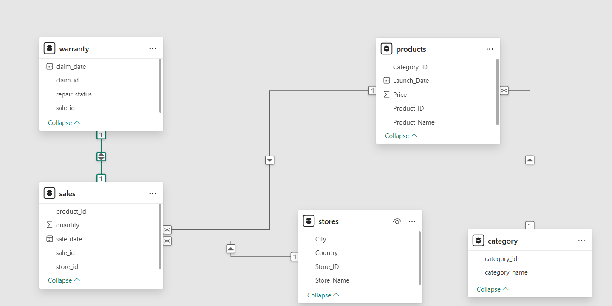

## apple-sql-practice-queries
This project uses a mock Apple retail dataset, with SQL queries covering data exploration (SELECT, JOIN, GROUP BY), aggregation (SUM, COUNT, AVG), performance optimization (CREATE INDEX), and window functions (ROW_NUMBER, LAG). This repository demonstrates practical SQL skills for a data analyst role, focusing on business-relevant analysis.

## Data Files

This repository contains a ZIP file with the following datasets:

- `category.csv`: Contains details about product categories.
- `products.csv`: Contains information about Apple products.
- `sales.csv`: Contains sales transactions.
- `stores.csv`: Contains information about retail store locations.
- `warranty.csv`: Contains warranty claims.

### How to Use the Data

1. Download the ZIP file from the repository.
2. Extract the contents of the ZIP file to your local machine.
3. Load the individual CSV files into your SQL database or data analysis tool.

## Apple Database Table Schema image



**Description:**  
The image above illustrates the schema of the Apple database tables used in this project. It shows the structure and relationships between tables such as

## Database Schema

The dataset includes the following tables:

### 1. **stores**  
Details of Apple retail locations, including store ID, name, city, and country.

| **Column Name** | **Description**                                    |
|-----------------|----------------------------------------------------|
| `store_id`      | Unique identifier for each store.                 |
| `store_name`    | Name of the store.                                |
| `city`          | City where the store is located.                  |
| `country`       | Country where the store is located.               |

### 2. **category**  
Product category details, including category ID and name.

| **Column Name** | **Description**                                      |
|-----------------|------------------------------------------------------|
| `category_id`   | Unique identifier for each product category.        |
| `category_name` | Name of the product category.                       |

### 3. **products**  
Information on Apple products, including product ID, name, launch date, and price.

| **Column Name** | **Description**                                      |
|-----------------|------------------------------------------------------|
| `product_id`    | Unique identifier for each product.                 |
| `product_name`  | Name of the product.                                |
| `category_id`   | References the `category` table.                     |
| `launch_date`   | Date when the product was launched.                 |
| `price`         | Price of the product.                               |

### 4. **sales**  
Sales transaction details, including sale date, store ID, product ID, and quantity sold.

| **Column Name** | **Description**                                      |
|-----------------|------------------------------------------------------|
| `sale_id`       | Unique identifier for each sale.                    |
| `sale_date`     | Date of the sale.                                   |
| `store_id`      | References the `stores` table.                      |
| `product_id`    | References the `products` table.                    |
| `quantity`      | Number of units sold in the transaction.            |

### 5. **warranty**  
Warranty claims, including claim ID, claim date, and repair status.

| **Column Name** | **Description**                                      |
|-----------------|------------------------------------------------------|
| `claim_id`      | Unique identifier for each warranty claim.          |
| `claim_date`    | Date the claim was made.                            |
| `sale_id`       | References the `sales` table.                       |
| `repair_status` | Status of the warranty claim (e.g., "Paid Repaired", "Warranty Void"). |

# SQL Analysis Repository

This repository contains a collection of SQL queries used for data analysis on various tasks related to Apple product sales, stores, warranty claims, and more.

---
## **PERFORMANCE IMPROVEMENT: Add composite indexes**
```sql
CREATE INDEX idx_store_product ON apple_sales(store_id, product_id);
CREATE INDEX idx_sales_date    ON apple_sales(sale_date);
```

## **Task 1: Find the Number of Stores in Each Country**

```sql
SELECT 
    country, 
    COUNT(store_name) AS store_count
FROM apple_store
GROUP BY country
ORDER BY store_count DESC;
-- Note: U.S. has the highest number of stores (15)
```

## **TASK 2: Find the top 5 stores with the highest total unit sales**
```sql
WITH store_sales_cte AS (
    SELECT *
    FROM apple_sales AS ap_sa
    INNER JOIN apple_store AS ap_st ON ap_sa.store_id = ap_st.store_id
)
SELECT
    store_name,
    SUM(quantity) AS total_unit_sold
FROM store_sales_cte
GROUP BY store_name
ORDER BY total_unit_sold DESC
LIMIT 5;
-- 1. Apple Chadstone       → 153,181
-- 2. Apple Covent Garden   → 152,745
-- 3. Apple The Dubai Mall  → 152,404
-- 4. Apple Central World   → 151,302
-- 5. Apple Orchard Road    → 151,116
```


## **TASK 3: Find the number of sales in December 2023**
```sql
WITH dec_sales_cte AS (
    SELECT *
    FROM apple_sales
    WHERE sale_date BETWEEN DATE '2023-12-01' AND DATE '2023-12-31'
)
SELECT
    COUNT(sale_id) AS sale_count
FROM dec_sales_cte;
-- Note: 18,076 sales occurred in December 2023
```

## **TASK 4: Find the number of stores with no warranty claims**
```sql
WITH warranty_claims_cte AS (
    SELECT *
    FROM apple_sales AS ap_sa
    LEFT JOIN apple_warranty AS ap_wa ON ap_sa.sale_id = ap_wa.sale_id
)
SELECT
    COUNT(DISTINCT store_id) AS store_without_claims
FROM warranty_claims_cte
WHERE repair_status IS NULL;
-- Note: there are 75 stores without any claim
```

## **TASK 5: Find the percentage of warranty claims that were rejected**
```sql
SELECT
    ROUND(
        COUNT(claim_id) * 100.0 /
        (SELECT COUNT(*) FROM apple_warranty)::NUMERIC,
        2
    ) AS rejected_percentage
FROM apple_warranty
WHERE repair_status = 'Rejected';
-- Note: Approximately 25% of warranty claims were rejected
```

## **TASK 6: Find the store with the highest unit sales in 2022**
```sql
WITH yearly_sales_cte AS (
    SELECT *
    FROM apple_sales AS ap_sa
    INNER JOIN apple_store AS ap_st ON ap_sa.store_id = ap_st.store_id
    WHERE sale_date BETWEEN '2022-01-01' AND '2022-12-31'
)
SELECT
    store_name,
    SUM(quantity) AS unit_sold
FROM yearly_sales_cte
GROUP BY store_name
ORDER BY unit_sold DESC
LIMIT 1;
-- Note: Apple Orchard Road sold the most units in 2022 (31,289)
```

## **TASK 7: Find the average price of products by category**
```sql
WITH price_by_category AS (
    SELECT *
    FROM apple_product AS ap_pr
    JOIN apple_category AS ap_ca ON ap_pr.category_id = ap_ca.category_id
)
SELECT
    category_name,
    ROUND(AVG(price)::NUMERIC, 2) AS avg_price
FROM price_by_category
GROUP BY category_name
ORDER BY avg_price DESC;
-- Note:
-- Tablet  → avg price 1479/-
-- Laptop  → avg price 1194/-
-- Wearable → avg price 1146/-
```

## **TASK 8: Find the date each store had its highest quantity sold**
```sql
SELECT
    store_id,
    sale_date,
    total_quantity
FROM (
    SELECT
        store_id,
        sale_date,
        SUM(quantity) AS total_quantity,
        ROW_NUMBER() OVER (PARTITION BY store_id ORDER BY SUM(quantity) DESC) AS row_num
    FROM apple_sales
    GROUP BY store_id, sale_date
) AS ranked_sales
WHERE row_num = 1
ORDER BY total_quantity DESC;
-- Note:
-- Store ID | Sale Date   | Quantity Sold
-- ST-73    | 2022-04-26  | 145
-- ST-43    | 2021-03-14  | 139
-- ST-21    | 2020-09-26  | 137
-- ST-59    | 2024-09-29  | 137
-- ST-41    | 2021-09-16  | 136
```

## **TASK 9: Find the least selling product per country and in which year**
```sql
WITH sales_with_country AS (
    SELECT
        aps.sale_date,
        aps.product_id,
        aps.quantity,
        aps.store_id,
        apst.country
    FROM apple_sales AS aps
    JOIN apple_store AS apst ON aps.store_id = apst.store_id
)
SELECT
    country,
    product_id,
    total_quantity,
    sale_year
FROM (
    SELECT
        product_id,
        country,
        EXTRACT(YEAR FROM sale_date) AS sale_year,
        SUM(quantity) AS total_quantity,
        ROW_NUMBER() OVER (PARTITION BY country ORDER BY SUM(quantity) ASC) AS row_num
    FROM sales_with_country
    GROUP BY product_id, country, sale_year
) AS least_selling
WHERE row_num = 1;
```

## **TASK 10: Year-over-year quantity growth per store**
```sql
WITH base_cte AS (
    SELECT
        apst.store_name,
        aps.quantity,
        aps.sale_date,
        aps.store_id
    FROM apple_sales AS aps
    JOIN apple_store AS apst ON aps.store_id = apst.store_id
),
yearly_totals AS (
    SELECT
        store_name,
        EXTRACT(YEAR FROM sale_date) AS sale_year,
        SUM(quantity) AS total_quantity
    FROM base_cte
    GROUP BY store_name, sale_year
),
growth_cte AS (
    SELECT
        store_name,
        sale_year,
        total_quantity,
        LAG(total_quantity) OVER (PARTITION BY store_name ORDER BY sale_year) AS previous_year_sale
    FROM yearly_totals
)
SELECT
    store_name,
    sale_year,
    total_quantity,
    previous_year_sale,
    ROUND(
        ((total_quantity - previous_year_sale) * 100.0) / NULLIF(previous_year_sale, 0),
        2
    ) AS percent_growth
FROM growth_cte;
```

## **TASK 11: Identify the product categories with the highest warranty claim rate per store  and analyze how this trend varies across different countries**
```sql
WITH t1 AS (
    SELECT
        ap_ca.category_name,
        ap_pr.product_name,
        ap_st.store_name,
        ap_st.country,
        ap_wa.claim_id,
        ap_sa.quantity
    FROM apple_category AS ap_ca
    JOIN apple_product AS ap_pr ON ap_ca.category_id = ap_pr.category_id
    JOIN apple_sales AS ap_sa ON ap_pr.product_id = ap_sa.product_id
    JOIN apple_store AS ap_st ON ap_sa.store_id = ap_st.store_id
    JOIN apple_warranty AS ap_wa ON ap_sa.sale_id = ap_wa.sale_id
)
SELECT
    category_name,
    country,
    store_name,
    SUM(quantity) AS total_quantity,
    COUNT(claim_id) AS warranty_claims,
    ROUND(
        (COUNT(claim_id)::NUMERIC / SUM(quantity)::NUMERIC) * 100,
        2
    ) AS claim_rate
FROM t1
GROUP BY category_name, store_name, country
ORDER BY claim_rate DESC;
```
